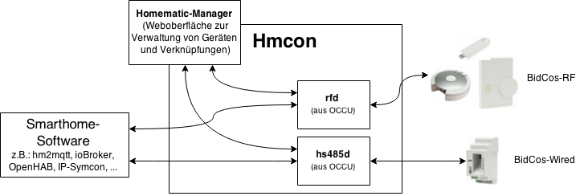

# Hmcon

Homematic Funk-/Wired-Schnittstellen-Software



Hmcon dient als Schnittstelle zwischen Smarthome-Software wie z.B. hm2mqtt, ioBroker oder OpenHAB und Homematic Funk-
und Wired-Geräten. Hierfür kommen die Schnittstellenprozesse "rfd" und "hs485d" zum Einsatz, die
[eQ-3](http://www.eq-3.de) als Teil der [OCCU](https://github.com/eq-3/occu) zur Verfügung stellt. Auf die Logikschicht
"ReGa" und das HomeMatic WebUI wird bewusst verzichtet, Hmcon nutzt den
[Homematic Manager](https://github.com/hobbyquaker/homematic-manager) als Weboberfläche zur Verwaltung von Geräten und
Direktverknüpfungen.

Bisher getestete Betriebssysteme: Debian Wheezy (armhf), Ubuntu 14.04 (amd64)

Unterstützte Architekturen: armhf, i386, amd64

Um Hmcon auf einem 64 Bit Betriebssystem auszuführen, ist es notwendig 32 Bit Bibliotheken zu installieren (siehe z.B.
http://askubuntu.com/questions/454253/how-to-run-32-bit-app-in-ubuntu-64-bit).


## Installation

Hmcon wird mit einem interaktiven Shell-Script installiert, dass die benötigten Software-Komponenten herunterlädt sowie
Konfigurationsdateien und Startscripte anlegt.


```Shell
wget https://github.com/hobbyquaker/hmcon/raw/master/hmcon-setup.sh
chmod a+x hmcon-setup.sh
sudo hmcon-setup.sh
```

## Lizenz

Copyright (c) 2015 Sebastian 'hobbyquaker' Raff <hq@ccu.io>

Licensed under the Apache License, Version 2.0 (the "License");
you may not use this file except in compliance with the License.
You may obtain a copy of the License at

http://www.apache.org/licenses/LICENSE-2.0

Unless required by applicable law or agreed to in writing, software
distributed under the License is distributed on an "AS IS" BASIS,
WITHOUT WARRANTIES OR CONDITIONS OF ANY KIND, either express or implied.
See the License for the specific language governing permissions and
limitations under the License.